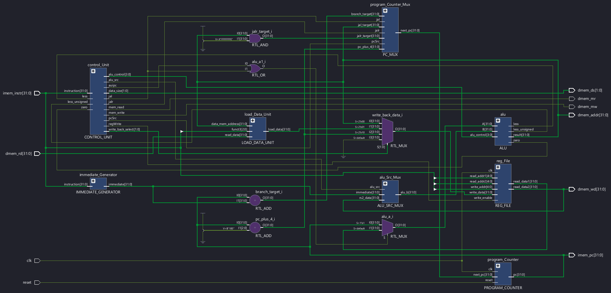
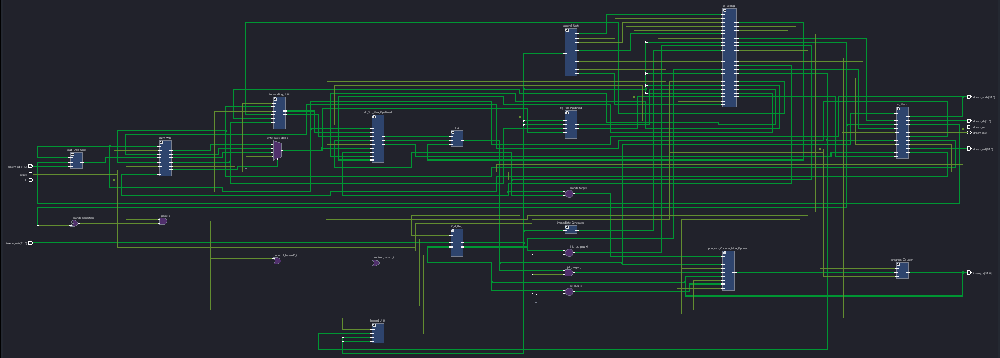
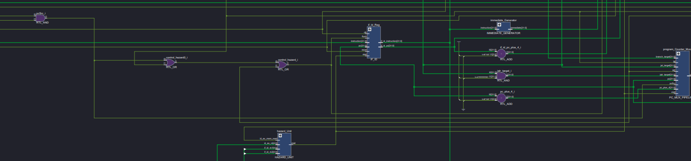
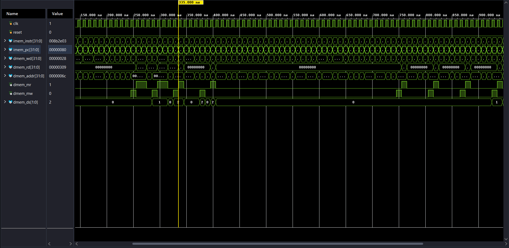
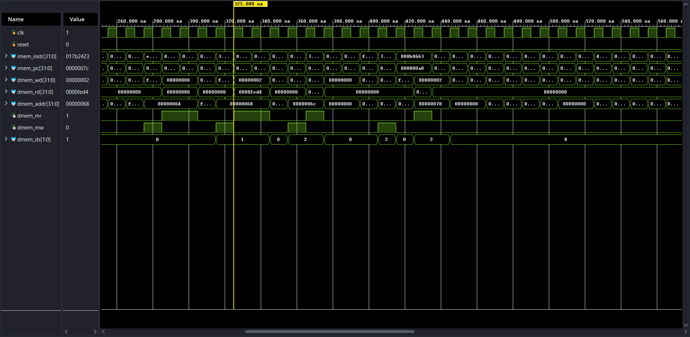
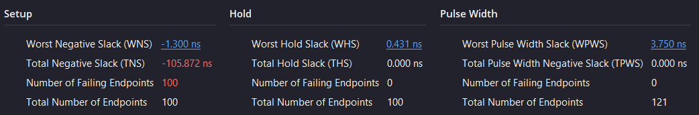
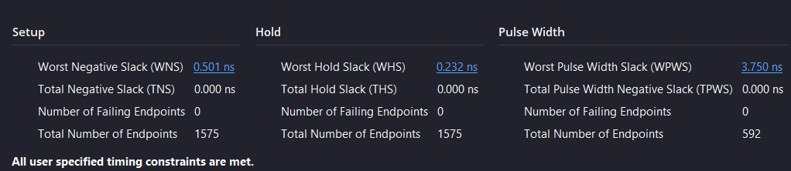
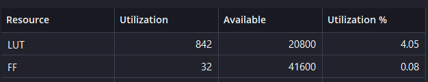
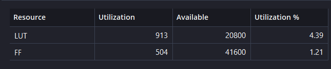

# 32-bit RISC-V Processor — Single-Cycle & 5-Stage Pipelined

## Overview

This repository contains a 32-bit RISC-V integer processor implemented and verified in Verilog, in two architectural versions:

1. **Single-cycle processor** — a baseline implementation where each instruction completes in one clock cycle.
2. **5-stage pipelined processor** — an extension of the single-cycle design into a classic `IF → ID → EX → MEM → WB` pipeline, with data forwarding and hazard handling.

The project covers RTL implementation of the RISC-V ISA, functional verification in simulation, pipelining with forwarding and hazard resolution, synthesis in Xilinx Vivado, static timing analysis, critical-path identification, and RTL-level timing optimization.

## Architecture

### Single-Cycle

Each instruction is fetched, decoded, executed, memory-accessed, and written back within a single clock cycle.



A high-resolution version is available at [`docs/single_cycle/architecture.pdf`](docs/single_cycle/architecture_schematic_high_res.pdf).

### 5-Stage Pipeline

The pipelined processor splits execution into five stages — `IF`, `ID`, `EX`, `MEM`, `WB` — separated by pipeline registers:

- `IF/ID`
- `ID/EX`
- `EX/MEM`
- `MEM/WB`

It includes:

- Data forwarding
- Hazard detection and handling
- Control/branch hazard handling
- Separate branch comparison logic



A high-resolution version is available at [`docs/pipelined/architecture.pdf`](docs/pipelined/architecture_schematic_high_res.pdf).

Hazard detection and resolution behavior is illustrated below:



## Supported ISA

The processor implements 37 instructions from the RV32I base integer ISA. `MUL` is not part of the final design. `ECALL` and `EBREAK` are not implemented.

| Type | Instructions |
|---|---|
| R-Type | ADD, SUB, AND, OR, XOR, SLL, SRL, SRA, SLT, SLTU |
| I-Type (ALU/Immediate) | ADDI, ANDI, ORI, XORI, SLTI, SLTIU, SLLI, SRLI, SRAI |
| I-Type (Load) | LB, LH, LW, LBU, LHU |
| I-Type (Jump) | JALR |
| S-Type | SB, SH, SW |
| B-Type | BEQ, BNE, BLT, BGE, BLTU, BGEU |
| U-Type | LUI, AUIPC |
| J-Type | JAL |

## Verification

Both processors were functionally verified using Verilog simulation.

**Tools:** Verilog, Icarus Verilog, GTKWave

Simulation RTL and testbench environments are organized under:

```
simulation/
├── single_cycle/
└── pipelined/
```

Each directory contains the simulation-specific RTL/testbench files used to exercise and verify the corresponding processor version. Representative simulation waveforms are documented in `docs/single_cycle/simulation_waveform.png` and `docs/pipelined/simulation_waveform.png`.





## Synthesis & Timing Analysis

Both processor architectures were synthesized using Xilinx Vivado. Timing analysis was performed under a 10 ns clock constraint. The results below are **post-synthesis** timing and utilization figures, not place-and-route/implementation results.

| Metric | Single-Cycle | 5-Stage Pipelined |
|---|---:|---:|
| LUT | 842 | 913 |
| Flip-Flops | 32 | 504 |
| Distributed RAM LUTs | 48 | 48 |
| WNS | -1.300 ns | +0.501 ns |
| TNS | -105.872 ns | 0 ns |
| Failing Endpoints | 100 | 0 |
| Fmax* | ~88.5 MHz | ~105.3 MHz |

*Fmax is calculated from the post-synthesis worst-case timing requirement (`1 / (clock period − WNS)`), not a measured or place-and-route/implementation clock frequency.









## RTL Timing Optimization

The pipelined processor initially failed timing significantly. The violation was resolved through a sequence of RTL changes, tracked via post-synthesis WNS at each step:

| Stage | WNS |
|---|---:|
| Original pipelined CPU + MUL | -8.901 ns |
| After removing MUL | -3.300 ns |
| After introducing a separate branch comparator | -0.169 ns |
| After optimizing comparator selection using Boolean logic | +0.501 ns |
### Separate Branch Comparator

To reduce the critical path through the main ALU, branch comparison was moved into dedicated comparator logic in the EX stage.

```verilog
// EX Stage: Fast Branch Comparator Logic

// Inputs to branch comparison
wire [31:0] cmp_a = alu_a;
wire [31:0] cmp_b = forwarded_rs2;

// Subtraction result for magnitude comparison
wire [31:0] cmp_sub_result = cmp_a - cmp_b;

// Equality
wire eq = ~|(cmp_a ^ cmp_b);

// Sign comparison
wire signs_differ = cmp_a[31] ^ cmp_b[31];

// Signed less-than: BLT / BGE
wire slt = signs_differ ? cmp_a[31] : cmp_sub_result[31];

// Unsigned less-than: BLTU / BGEU
wire ult = signs_differ ? cmp_b[31] : cmp_sub_result[31];

// Select comparison result
reg cmp_out;

always @(*) begin
    case (id_ex_funct3[2:1])
        2'b00:   cmp_out = eq;   // BEQ / BNE
        2'b10:   cmp_out = slt;  // BLT / BGE
        2'b11:   cmp_out = ult;  // BLTU / BGEU
        default: cmp_out = 1'b0;
    endcase
end

// Invert for BNE, BGE, and BGEU using funct3[0]
wire branch_condition = cmp_out ^ id_ex_funct3[0];

// Final branch decision
wire pcSrc = id_ex_branch && branch_condition;
```

The comparator handles all six conditional branch instructions: `BEQ`, `BNE`, `BLT`, `BGE`, `BLTU`, and `BGEU`.

Separating branch comparison from the main ALU reduced the timing-critical logic. The subsequent Boolean optimization of comparator selection further improved the post-synthesis WNS from **-0.169 ns to +0.501 ns**.

**Final result:** WNS = +0.501 ns, TNS = 0 ns, 0 failing endpoints, under a 10 ns clock constraint.

## Single-Cycle vs. Pipelined Comparison

The pipelined implementation closes timing where the single-cycle design does not, at the cost of additional resources:

- **LUTs:** 842 → 1082
- **Flip-Flops:** 32 → 504
- **Distributed RAM LUTs:** unchanged at 48
- **Timing:** single-cycle fails timing under the 10 ns constraint (WNS = -1.300 ns, 100 failing endpoints); the pipelined design meets timing (WNS = +0.501 ns, 0 failing endpoints)

The increase in flip-flop count reflects the pipeline registers (`IF/ID`, `ID/EX`, `EX/MEM`, `MEM/WB`) required to carry instruction data, operands, control signals, ALU results, memory data, and write-back state between stages.

A side-by-side summary is documented in [`docs/comparison.md`](docs/comparison.md).

## Repository Structure

```
RISCV_CPU/
├── README.md
├── docs/
│   ├── pipelined/
│   ├── single_cycle/
│   └── comparison.md
├── simulation/
│   ├── single_cycle/
│   └── pipelined/
└── vivado/
    ├── single_cycle/
    └── pipelined/
```

- `docs/` — architecture diagrams, simulation waveforms, and timing/utilization summaries(post synthesis) for both versions
- `simulation/` — simulation RTL and testbench environment for each version
- `vivado/` — Vivado project sources for synthesis and timing analysis of each version

## Tools

- Verilog
- Icarus Verilog
- GTKWave
- Xilinx Vivado
